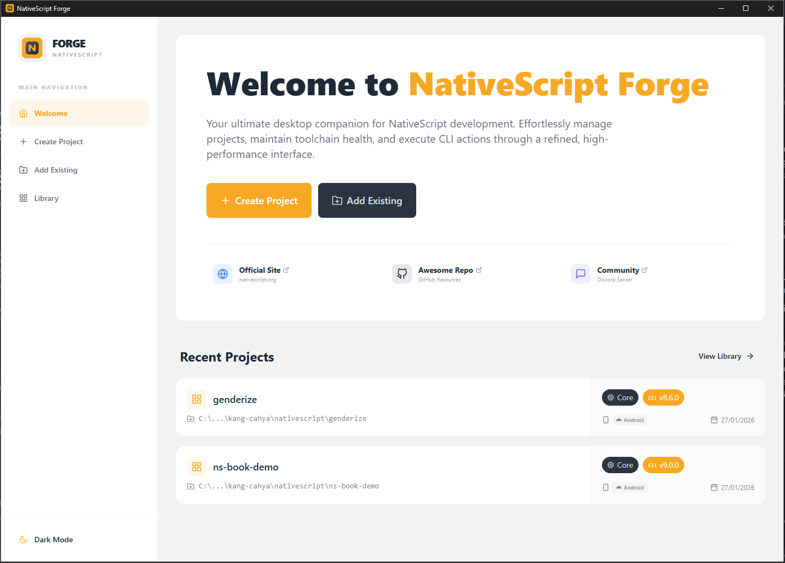

<div align="center">
  
  <br />
  <br />

[](https://tauri.app)
[](https://react.dev)
[](https://www.typescriptlang.org)
[](https://tailwindcss.com)

  <p align="center">
    <b>Simplify, Visualize, and Control your NativeScript Workflow</b>
  </p>
</div>

---

**NativeScript Forge** is a community-built development studio designed to simplify, visualize, and control the NativeScript development workflow. It provides developers with a unified graphical interface to manage projects, environments, plugins, builds, and platform configurations—without replacing the NativeScript CLI. NativeScript Forge focuses on transparency, safety, and productivity, helping developers reduce setup friction, avoid common pitfalls, and stay in control of complex NativeScript projects.



## 🧐 The Problem

NativeScript development is powerful but can be complex. Managing different versions of Node, Java, Android SDKs, and CocoaPods across multiple projects often leads to "it works on my machine" issues. New developers face a steep learning curve, and even experienced ones can lose time troubleshooting environment misconfigurations or complex CLI flags.

## 💡 The Solution

NativeScript Forge aims to address these problems by providing a unified graphical interface—a single control panel—that visualizes and orchestrates the NativeScript development workflow. Instead of replacing the NativeScript CLI, NativeScript Forge makes it more transparent, safer, and easier to manage, allowing developers to focus on building features rather than fighting tooling complexity.

## ✨ Key Features

- **🗂 Project Library**: Centralized management for all your NativeScript projects.
- **🩺 Environment Doctor**: Built-in diagnostics to ensure your dev environment (Android SDK, Java, Node.js) is ready.
- **🚀 CLI Orchestration**: Visual interface for common CLI commands, reducing the need to memorize flags.
- **📊 Metadata & Insights**: Quickly view project details, plugins, permissions, and target SDK versions.
- **🎨 Modern UI**: Built with a responsive and dark-mode friendly interface using DaisyUI.

## 🛠 Tech Stack

- **Core**: [Tauri v2](https://tauri.app) (Rust)
- **Frontend**: React 19, TypeScript, Vite
- **Styling**: TailwindCSS, DaisyUI
- **Database**: SQLite (via Tauri Plugin)

## 🚀 Getting Started

### Prerequisites

- **Node.js** (v18 or later)
- **Rust** (for Tauri development)
- **Android Studio / Xcode** (for NativeScript development)

### Installation

1. Clone the repository:

   ```bash
   git clone https://github.com/your-username/ns-forge.git
   cd ns-forge
   ```

2. Install dependencies:

   ```bash
   npm install
   # or
   bun install
   ```

3. Run the application in development mode:
   ```bash
   npm run tauri dev
   # or
   bun run tauri dev
   ```

## 🗺️ Roadmap

We are committed to evolving NativeScript Forge alongside the community. Here is a high-level look at our journey:

- **✅ Phase 0: Foundation** - Branding, repository structure, and core principles.
- **🚧 Phase 1: MVP (Current)** - Project discovery, environment health checks (Doctor), and basic CLI actions.
- **🧪 Phase 2: Productivity** - Plugin management, visual configuration editor, and platform cleanup tools.
- **🧪 Phase 3: Advanced Tooling** - Migration assistants, signing management, and device inspection.
- **🧪 Phase 4: Ecosystem** - CI/CD presets, environment variables, and community knowledge base.

For a detailed breakdown of our plans, check out the full [ROADMAPS.md](./ROADMAPS.md).

---

## 💾 Database & Migrations

NativeScript Forge uses SQLite for persistent storage. To ensure data integrity and avoid errors during development:

- **Golden Rule**: Never modify an existing migration (e.g., `version: 1`). If you need to change the schema (add columns, etc.), always create a **new version** (e.g., `version: 4`) in `src-tauri/src/lib.rs`.
- **Error: "migration was modified"**: This happens if you change the SQL of a version that has already been applied. To fix this, you must reset the database.
- **Resetting the Database**: Delete the database files in your app data folder:
  - Windows: `%APPDATA%\com.kangcahya.nativescript-forge-app\nsforge.db`
  - This will clear all projects and logs, and re-apply all migrations from scratch.

---

<div align="center">
  
  <p><i>Built with ❤️ for the NativeScript Community</i></p>
</div>
